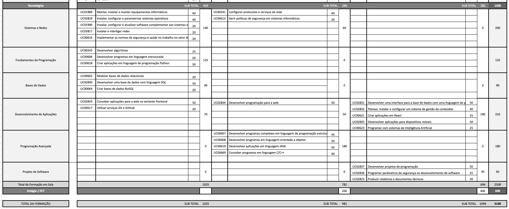

# Proposta de Plano Curricular

- **Curso:** 481RA116 - Técnico/a de Desenvolvimento de Software
- **Triénio:** 2026-2029

---

## 1. Distribuição global de horas por ano

| Ano       |      Horas | Observação geral                                          |
| --------- | ---------: | --------------------------------------------------------- |
| 1.º ano   |      525 h | Ano de base técnica e entrada no desenvolvimento          |
| 2.º ano   |      325 h | Consolidação de programação, bases de dados e web         |
| 3.º ano   |      250 h | Aplicação prática, segurança, aplicações móveis e projeto |
| **Total** | **1100 h** | **Componente tecnológica**                                |

---

## 2. UC opcionais escolhidas

| Código    | Unidade de Competência                              | Créditos |   Horas |
| --------- | --------------------------------------------------- | -------: | ------: |
| UC00618   | Criar aplicações em linguagem de programação Python |      4,5 |      50 |
| UC00619   | Desenvolver aplicações em linguagem JAVA            |      4,5 |      50 |
| UC00669   | Conceber programas em linguagem C/C++               |      4,5 |      50 |
| UC00621   | Criar aplicações em React                           |     2,25 |      25 |
| UC00664   | Criar bases de dados NoSQL                          |     2,25 |      25 |
| UC00627   | Instalar e configurar servidores Web                |     2,25 |      25 |
| UC00617   | Utilizar serviços Git e GitHub                      |     2,25 |      25 |
| **Total** |                                                     | **22,5** | **250** |

---

## 3. Estrutura final proposta

### 3.1) Visão global das 8 disciplinas novas

> Estas disciplinas vão substituir as atuais disciplinas de Programador de Informática.

|        Nº | Disciplina                 | Horas totais | Sugestão de Professor \*      | Observação                                                          |
| --------: | -------------------------- | -----------: | ----------------------------- | ------------------------------------------------------------------- |
|         1 | Sistemas e Redes           |          250 | João Paulo                    | Disciplina apenas do 1.º ano, concentrando a base técnica           |
|         2 | Fundamentos de Programação |          125 | Nuno Castro                   | Entrada progressiva em algoritmia e programação                     |
|         3 | Bases de Dados             |          100 | Paulo Nabais / Carlos Coimbra | Disciplina vertical entre 1.º e 2.º ano                             |
|         4 | Desenvolvimento Web        |          250 | Nuno Castro                   | Disciplina vertical entre 1.º, 2.º e 3.º ano                        |
|         5 | Programação Avançada       |          200 | Nuno Castro                   | Consolidação de programação estruturada avançada, POO, Java e C/C++ |
|         6 | Aplicações Móveis          |           50 | Paulo Nabais / Carlos Coimbra | Área autónoma no 3.º ano                                            |
|         7 | Segurança Aplicada         |           50 | Nuno Castro                   | Codificação segura, publicação e operação web                       |
|         8 | Projeto de Software        |           75 | Nuno Castro                   | Fecho do curso com projeto e documentação                           |
| **Total** |                            |     **1100** |                               |                                                                     |

**\* Nota:** A Sugestão de Professor é feita com base nas disciplinas dadas no Curso de Programador de Informática.

### 3.2) Totais globais do curso

| Indicador               | Valor |
| ----------------------- | ----: |
| Nº total de disciplinas |     8 |
| Nº total de UC          |    28 |
| Horas totais            |  1100 |

---

## 4. Distribuição das disciplinas por ano

### 4.1) 1.º ano - 525 horas

| Disciplina                 | Horas no ano |
| -------------------------- | -----------: |
| Sistemas e Redes           |          250 |
| Fundamentos de Programação |          125 |
| Bases de Dados             |           75 |
| Desenvolvimento Web        |           75 |
| **Total**                  |      **525** |

### 4.2) 2.º ano - 325 horas

| Disciplina           | Horas no ano |
| -------------------- | -----------: |
| Programação Avançada |          200 |
| Bases de Dados       |           25 |
| Desenvolvimento Web  |          100 |
| **Total**            |      **325** |

### 4.3) 3.º ano - 250 horas

| Disciplina          | Horas no ano |
| ------------------- | -----------: |
| Desenvolvimento Web |           75 |
| Aplicações Móveis   |           50 |
| Segurança Aplicada  |           50 |
| Projeto de Software |           75 |
| **Total**           |      **250** |

---

## 5. Descrição de cada disciplina

### 5.1) Sistemas e Redes

- **Horas:** 250h
- **Ano:** 1.º ano
- **Objectivo:** Criar a base técnica do curso no 1.º ano, concentrando hardware, sistemas operativos, redes, segurança base e segurança/saúde no trabalho em ambiente técnico.
- **Área da Disciplina:** Infraestruturas Informáticas (Hardware, Sistemas Operativos, Redes e Segurança Base)
- **Descrição:** Disciplina estruturante do 1.º ano, alinhada com as UC obrigatórias do referencial para instalação e manutenção de equipamentos, configuração de sistemas operativos, interligação de redes, serviços/protocolos e segurança operacional. É a base infraestrutural que suporta as disciplinas de desenvolvimento.

| Ano       | Código  | UC                                                                             |   Horas |
| --------- | ------- | ------------------------------------------------------------------------------ | ------: |
| 1.º       | UC01989 | Montar, instalar e manter equipamentos informáticos                            |      50 |
| 1.º       | UC02829 | Instalar, configurar e parametrizar sistemas operativos                        |      50 |
| 1.º       | UC01990 | Instalar, configurar e atualizar software complementar aos sistemas operativos |      25 |
| 1.º       | UC02817 | Instalar e interligar redes                                                    |      25 |
| 1.º       | UC00241 | Configurar protocolos e serviços de rede                                       |      50 |
| 1.º       | UC00613 | Gerir políticas de segurança em sistemas informáticos                          |      25 |
| 1.º       | UC00616 | Implementar as normas de segurança e saúde no trabalho no setor de Informática |      25 |
| **Total** |         |                                                                                | **250** |

---

### 5.2) Fundamentos de Programação

- **Horas:** 125h
- **Ano:** 1.º ano
- **Objectivo:** Introduzir pensamento computacional, algoritmia, lógica e primeira linguagem de programação, com uma entrada pedagógica progressiva.
- **Área da Disciplina:** Programação (Algoritmia e Fundamentos)
- **Descrição:** Disciplina de entrada na programação, com foco na construção de raciocínio algorítmico e domínio de estruturas de controlo. Combina UC obrigatórias de algoritmos e programação estruturada com a UC opcional de Python para facilitar a transição para desenvolvimento aplicado.

| Ano       | Código             | UC                                                  |   Horas |
| --------- | ------------------ | --------------------------------------------------- | ------: |
| 1.º       | UC00245            | Desenvolver algoritmos                              |      25 |
| 1.º       | UC00606            | Desenvolver programas em linguagem estruturada      |      50 |
| 1.º       | UC00618 (Opcional) | Criar aplicações em linguagem de programação Python |      50 |
| **Total** |                    |                                                     | **125** |

**Nota:**  
O uso de **Python** no 1.º ano permite uma entrada mais acessível e didática, sem abdicar da lógica e da estrutura.

---

### 5.3) Bases de Dados

- **Horas:** 100h
- **Ano:** 1.º e 2.º anos
- **Objectivo:** Construir um eixo vertical de dados entre o 1.º e o 2.º ano, centrado em modelação, SQL e extensão a bases de dados não relacionais.
- **Área da Disciplina:** Análise de Sistemas e Bases de Dados
- **Descrição:** Disciplina dedicada ao ciclo de dados no desenvolvimento de software: modelação relacional, implementação com SQL e extensão a NoSQL. Está alinhada com o referencial ao combinar fundamentos obrigatórios com uma opção tecnológica atual para cenários de dados não relacionais.

| Ano       | Código             | UC                                              |   Horas |
| --------- | ------------------ | ----------------------------------------------- | ------: |
| 1.º       | UC00602            | Modelar bases de dados relacionais              |      25 |
| 1.º       | UC02830            | Desenvolver uma base de dados com linguagem SQL |      50 |
| 2.º       | UC00664 (Opcional) | Criar bases de dados NoSQL                      |      25 |
| **Total** |                    |                                                 | **100** |

---

### 5.4) Desenvolvimento Web

- **Horas:** 250h
- **Ano:** 1.º, 2.º e 3.º anos
- **Objectivo:** Criar um eixo vertical de desenvolvimento web ao longo dos três anos, começando no front-end, avançando para programação web e integração com bases de dados, e fechando com CMS e React.
- **Área da Disciplina:** Programação e desenvolvimento Web. Integração de Sistemas
- **Descrição:** Disciplina vertical de desenvolvimento aplicacional orientada à web, cobrindo front-end, programação web, integração com bases de dados e gestão/publicação de conteúdos. Incorpora UC opcionais de Git/GitHub e React, reforçando práticas de colaboração e desenvolvimento front-end moderno.

| Ano       | Código             | UC                                                                              |   Horas |
| --------- | ------------------ | ------------------------------------------------------------------------------- | ------: |
| 1.º       | UC02833            | Conceber aplicações para a web na vertente frontend                             |      50 |
| 1.º       | UC00617 (Opcional) | Utilizar serviços Git e GitHub                                                  |      25 |
| 2.º       | UC02834            | Desenvolver programação para a web                                              |      50 |
| 2.º       | UC02831            | Desenvolver uma interface para a base de dados com uma linguagem de programação |      50 |
| 3.º       | UC02832            | Planear, instalar e configurar um sistema de gestão de conteúdos                |      50 |
| 3.º       | UC00621 (Opcional) | Criar aplicações em React                                                       |      25 |
| **Total** |                    |                                                                                 | **250** |

---

### 5.5) Programação Avançada

- **Horas:** 200h
- **Ano:** 2.º ano
- **Objectivo:** Consolidar programação estruturada avançada, orientação a objetos e uma base mais forte em linguagens compiladas e tipicamente mais formais.
- **Área da Disciplina:** Programação (Avançada e POO)
- **Descrição:** Disciplina de consolidação técnica no 2.º ano, com progressão de complexidade em programação estruturada e orientação a objetos. Integra Java e C/C++, alinhadas com o referencial para enriquecer competências de modelação de software e implementação em linguagens fortemente tipadas.

| Ano       | Código             | UC                                                                      |   Horas |
| --------- | ------------------ | ----------------------------------------------------------------------- | ------: |
| 2.º       | UC00607            | Desenvolver programas complexos em linguagem de programação estruturada |      50 |
| 2.º       | UC00608            | Desenvolver programas em linguagem orientada a objetos                  |      50 |
| 2.º       | UC00619 (Opcional) | Desenvolver aplicações em linguagem JAVA                                |      50 |
| 2.º       | UC00669 (Opcional) | Conceber programas em linguagem C/C++                                   |      50 |
| **Total** |                    |                                                                         | **200** |

---

### 5.6) Aplicações Móveis

- **Horas:** 50h
- **Ano:** 3.º ano
- **Objectivo:** Introdução ao desenvolvimento de aplicações móveis, para que os alunos tenham uma visão mais completa do desenvolvimento de software e possam explorar esta área em crescimento.
- **Área da Disciplina:** Desenvolvimento Mobile (pode ser teórico ou teórico-prático uma vez que 50 horas é pouco para prática)
- **Descrição:** Disciplina especializada do 3.º ano orientada para desenvolvimento de aplicações móveis, em linha com a UC obrigatória do referencial. Amplia o perfil do aluno para contextos multiplataforma e reforça a capacidade de adaptação a diferentes interfaces e dispositivos.

| Ano       | Código  | UC                                              |  Horas |
| --------- | ------- | ----------------------------------------------- | -----: |
| 3.º       | UC02835 | Desenvolver aplicações para dispositivos móveis |     50 |
| **Total** |         |                                                 | **50** |

---

### 5.7) Segurança Aplicada

- **Horas:** 50h
- **Ano:** 3.º ano
- **Objectivo:** Trabalhar segurança no desenvolvimento de software e no contexto de publicação/operação de aplicações web.
- **Área da Disciplina:** Programação, Cibersegurança Aplicada ao Desenvolvimento
- **Descrição:** Disciplina focada em segurança aplicada, combinando práticas de codificação segura com configuração de servidores web. Responde às UC do referencial ligadas a segurança no ciclo de desenvolvimento e operação, aproximando o plano de exigências reais de produção.

| Ano       | Código             | UC                                                               |  Horas |
| --------- | ------------------ | ---------------------------------------------------------------- | -----: |
| 3.º       | UC02836            | Programar parâmetros de segurança no desenvolvimento de software |     25 |
| 3.º       | UC00627 (Opcional) | Instalar e configurar servidores Web                             |     25 |
| **Total** |                    |                                                                  | **50** |

---

### 5.8) Projeto de Software

**Nota:** Optei por colocar o projeto (e a documentação) numa disciplina à parte para que o projeto não seja "contaminado" pela disciplina onde fosse inserido. Por exemplo, se fosse inserido na disciplina de Desenvolvimento Web, o projeto poderia ser visto como um projeto de desenvolvimento web, o que não é necessariamente o caso. Ou se fosse inserido na disciplina de Programação Avançada, poderia ser visto como um projeto de programação pura, o que também não é necessariamente o caso. Limitaria a visão do projeto a um domínio específico, o que não é desejável. Assim, a disciplina de Projeto de Software pode ser mais transversal e permitir projetos mais variados, além de dar um enfoque específico à documentação técnica, que é uma competência importante a evidenciar.

- **Horas:** 75h
- **Ano:** 3.º ano
- **Objectivo:** Fechar o curso com projeto, integração de competências e produção de documentação técnica adequada ao contexto profissional.
- **Área da Disciplina:** Projeto de Software
- **Descrição:** Disciplina de fecho do percurso, com enfoque em execução de projeto de programação e comunicação técnica formal. Está alinhada com o referencial ao assegurar evidência integrada de competências técnicas e de documentação profissional.

| Ano       | Código  | UC                                        |  Horas |
| --------- | ------- | ----------------------------------------- | -----: |
| 3.º       | UC02837 | Desenvolver projetos de programação       |     50 |
| 3.º       | UC02823 | Produzir relatórios e documentos técnicos |     25 |
| **Total** |         |                                           | **75** |

---

## 6. Tabela global de mapeamento UC → ano → disciplina

| Código  | UC                                                                              | Horas | Ano | Disciplina proposta        |
| ------- | ------------------------------------------------------------------------------- | ----: | --- | -------------------------- |
| UC01989 | Montar, instalar e manter equipamentos informáticos                             |    50 | 1.º | Sistemas e Redes           |
| UC02829 | Instalar, configurar e parametrizar sistemas operativos                         |    50 | 1.º | Sistemas e Redes           |
| UC01990 | Instalar, configurar e atualizar software complementar aos sistemas operativos  |    25 | 1.º | Sistemas e Redes           |
| UC02817 | Instalar e interligar redes                                                     |    25 | 1.º | Sistemas e Redes           |
| UC00241 | Configurar protocolos e serviços de rede                                        |    50 | 1.º | Sistemas e Redes           |
| UC00613 | Gerir políticas de segurança em sistemas informáticos                           |    25 | 1.º | Sistemas e Redes           |
| UC00616 | Implementar as normas de segurança e saúde no trabalho no setor de Informática  |    25 | 1.º | Sistemas e Redes           |
| UC00245 | Desenvolver algoritmos                                                          |    25 | 1.º | Fundamentos de Programação |
| UC00606 | Desenvolver programas em linguagem estruturada                                  |    50 | 1.º | Fundamentos de Programação |
| UC00618 | Criar aplicações em linguagem de programação Python                             |    50 | 1.º | Fundamentos de Programação |
| UC00602 | Modelar bases de dados relacionais                                              |    25 | 1.º | Bases de Dados             |
| UC02830 | Desenvolver uma base de dados com linguagem SQL                                 |    50 | 1.º | Bases de Dados             |
| UC02833 | Conceber aplicações para a web na vertente frontend                             |    50 | 1.º | Desenvolvimento Web        |
| UC00617 | Utilizar serviços Git e GitHub                                                  |    25 | 1.º | Desenvolvimento Web        |
| UC00607 | Desenvolver programas complexos em linguagem de programação estruturada         |    50 | 2.º | Programação Avançada       |
| UC00608 | Desenvolver programas em linguagem orientada a objetos                          |    50 | 2.º | Programação Avançada       |
| UC00619 | Desenvolver aplicações em linguagem JAVA                                        |    50 | 2.º | Programação Avançada       |
| UC00669 | Conceber programas em linguagem C/C++                                           |    50 | 2.º | Programação Avançada       |
| UC00664 | Criar bases de dados NoSQL                                                      |    25 | 2.º | Bases de Dados             |
| UC02834 | Desenvolver programação para a web                                              |    50 | 2.º | Desenvolvimento Web        |
| UC02831 | Desenvolver uma interface para a base de dados com uma linguagem de programação |    50 | 2.º | Desenvolvimento Web        |
| UC02832 | Planear, instalar e configurar um sistema de gestão de conteúdos                |    50 | 3.º | Desenvolvimento Web        |
| UC00621 | Criar aplicações em React                                                       |    25 | 3.º | Desenvolvimento Web        |
| UC02835 | Desenvolver aplicações para dispositivos móveis                                 |    50 | 3.º | Aplicações Móveis          |
| UC02836 | Programar parâmetros de segurança no desenvolvimento de software                |    25 | 3.º | Segurança Aplicada         |
| UC00627 | Instalar e configurar servidores Web                                            |    25 | 3.º | Segurança Aplicada         |
| UC02837 | Desenvolver projetos de programação                                             |    50 | 3.º | Projeto de Software        |
| UC02823 | Produzir relatórios e documentos técnicos                                       |    25 | 3.º | Projeto de Software        |

---

## 7. Plano Curricular Proposto

[Ver plano curricular proposto](https://docs.google.com/spreadsheets/d/1VuvWeRKOqQLfXATec_sINFAli3lMwHyD/edit?usp=share_link&ouid=106815911914090637978&rtpof=true&sd=true)

---

## 8. Changelog

- **08-04-2026:**
    - Inserção de tabela global de mapeamento UC → ano → disciplina.
    - Inserção de tabela síntese do plano curricular proposto.

- **07-04-2026:**
    - Re-estruturação completa do curso com base nas 8 disciplinas novas, mantendo as UC obrigatórias e integrando as UC opcionais escolhidas.
    - Distribuição global de horas por ano e descrição detalhada de cada disciplina.

- **27-03-2026:**
    - Estruturação inicial do documento, com definição de objetivos e áreas para cada disciplina, e mapeamento das UC obrigatórias e opcionais.
